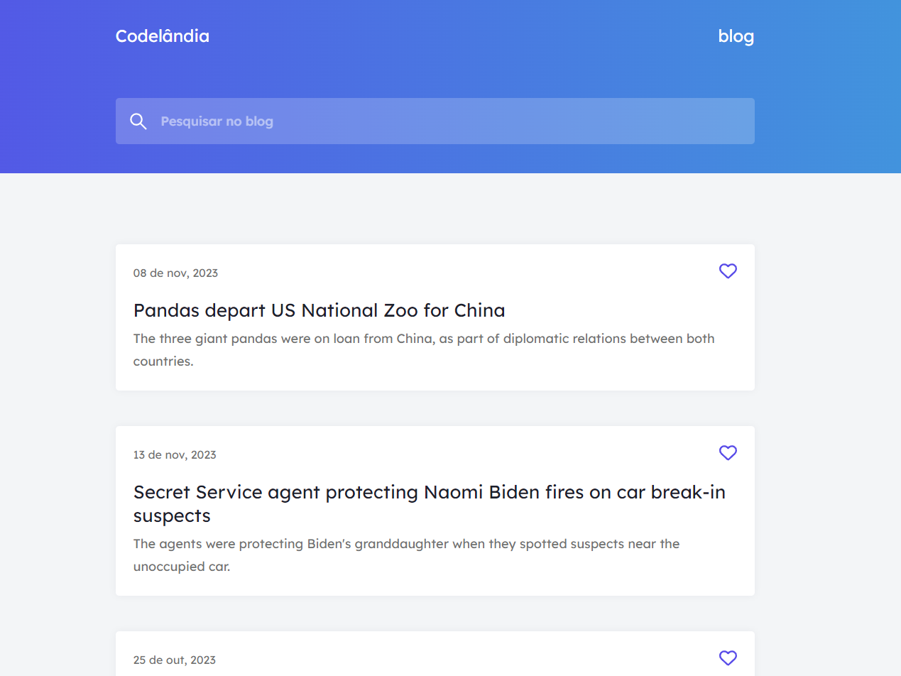
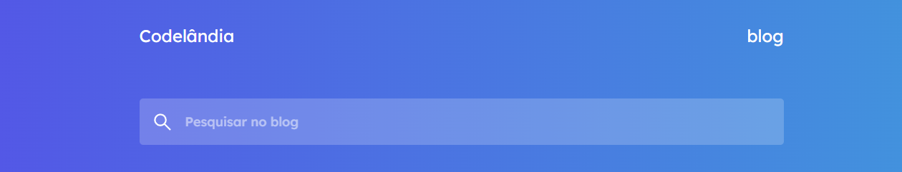
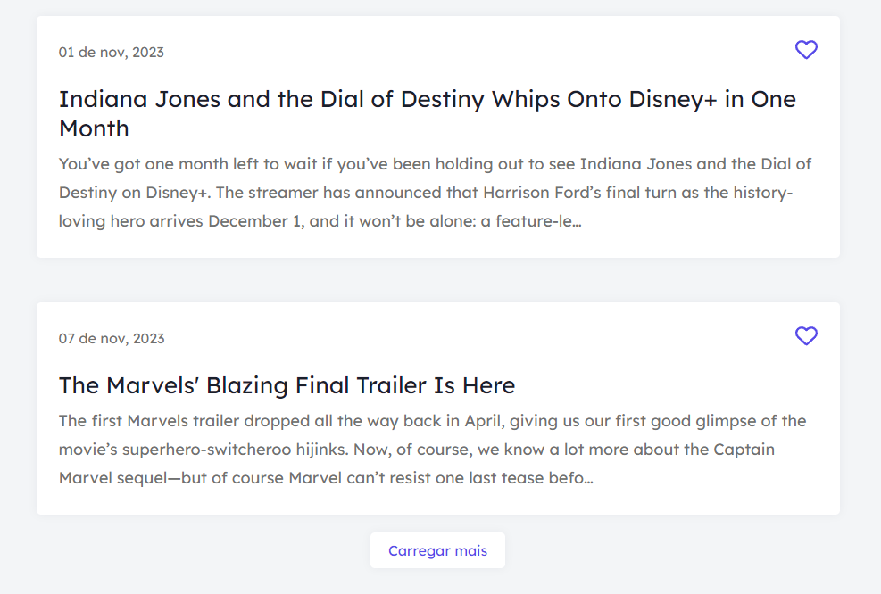

# Blog Codelândia



## About the project

This project is one of severals proposed by the Codelândia comunity and designed by [iuricode](https://github.com/iuricode).

Now, about the project itself. The main goal was to create a single page that would contain news articles about anything that the user could search for. Originally, the project would have static data for the article news. But I decided to make it dynamic by using an API for the news data.

## Features

The project have the following features:

### Search articles

The user'll be able to search any news articles by typing the article name or something that is correlated.



### Load more articles

Initially the article list would have only three articles. But when clicking on the button "Carregar mais" it'll be load three more articles.

OBS: The limit for the articles will be only 9, since I'm using the free plan from the API.



## Built with

- [React](https://react.dev/)
- [react-icons](https://react-icons.github.io/react-icons/)
- [Sass](https://sass-lang.com/)
- [Framer-Motion](https://www.framer.com/motion/)
- [Vite](https://vitejs.dev/)

## Run the aplicattion

To run the application on your machine, follow the next steps:

1. Clone the repositorie

   ```sh
   git clone https://github.com/JhowBRCG/Blog-Codelandia.git
   ```

2. Install the dependencies

   ```sh
   npm install
   ```

3. Initialize the server

   ```sh
   npm run dev
   ```

4. Now you can see the application in real time by putting the url http://localhost:5173/ in the browser of your choice.

## Author

Created by [@jhowbrcg](https://github.com/JhowBRCG) - fell free to contact me!

## License

This project is licensed under [MIT](https://opensource.org/licenses/MIT) license.
